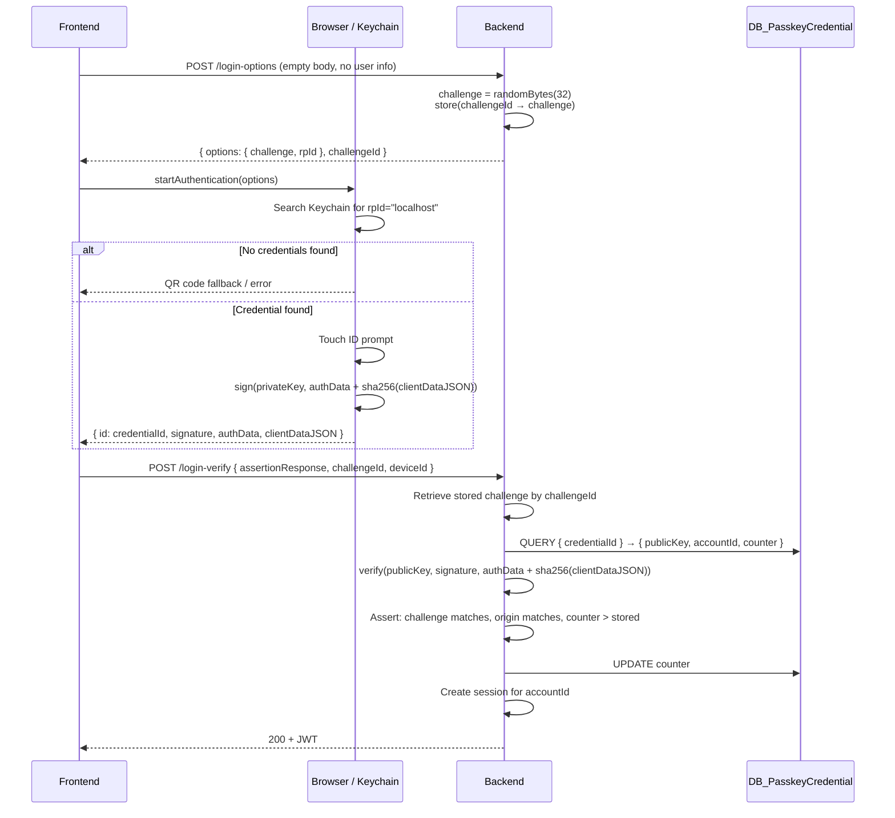

# Passkey Login Flow

User is NOT authenticated. Backend does not know which user is logging in.



## What Gets Signed

```
signatureBase = authenticatorData + SHA-256(clientDataJSON)
```

- `authenticatorData`: rpIdHash + flags + counter
- `clientDataJSON`: `{ type, challenge, origin }`

## What Travels Over the Network

| Field | Sensitive? | Purpose |
|-------|-----------|---------|
| challenge | No | One-time nonce (the "salt") |
| credentialId | No | Lookup key → publicKey + accountId |
| signature | No | Proves private key possession |
| clientDataJSON | No | Binds origin + challenge into signed payload |
| **privateKey** | **Yes** | **Never leaves device** |
