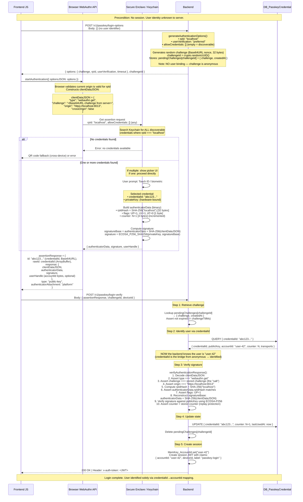
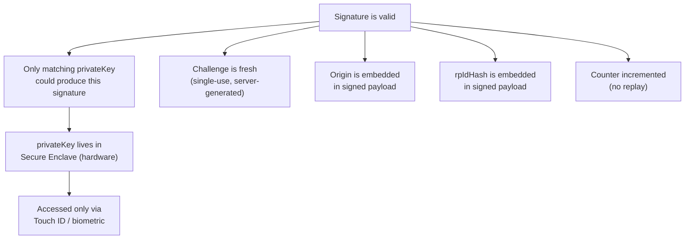

# Passkey Login Flow

User is NOT authenticated. No session exists. Backend does not know which user is logging in.

## Trust Chain (Why the Backend Trusts This)

## What Travels Over the Network

| Field | Direction | Sensitive? | Purpose |
|-------|-----------|-----------|---------|
| `challenge` | Server → Client | No | One-time nonce (the "salt"), prevents replay |
| `challengeId` | Server → Client → Server | No | Lookup key for stored challenge |
| `credentialId` | Client → Server | No | Maps to publicKey + accountId in DB |
| `clientDataJSON` | Client → Server | No | Contains origin + challenge for verification |
| `authenticatorData` | Client → Server | No | Contains rpIdHash + flags + counter |
| `signature` | Client → Server | No | Proves possession of privateKey |
| `deviceId` | Client → Server | No | Session metadata |
| **privateKey** | **NEVER** | **Yes** | **Never leaves Secure Enclave** |

## Cryptographic Operations During Login

| Step | Operation | Input | Output |
|------|-----------|-------|--------|
| Challenge generation (server) | `crypto.randomBytes` | entropy | 32-byte Base64URL nonce |
| clientDataJSON hash (browser) | SHA-256 | JSON string (contains challenge + origin) | 32-byte hash |
| rpIdHash (authenticator) | SHA-256 | `"localhost"` (UTF-8) | 32-byte hash embedded in authenticatorData |
| Signature (authenticator) | ECDSA-P256-SHA256 | `authenticatorData \|\| SHA-256(clientDataJSON)` | DER-encoded signature |
| Verification (server) | ECDSA-P256-SHA256 verify | publicKey + signatureBase + signature | boolean |
| Counter check (server) | Integer comparison | stored counter vs received counter | Assert received > stored |
