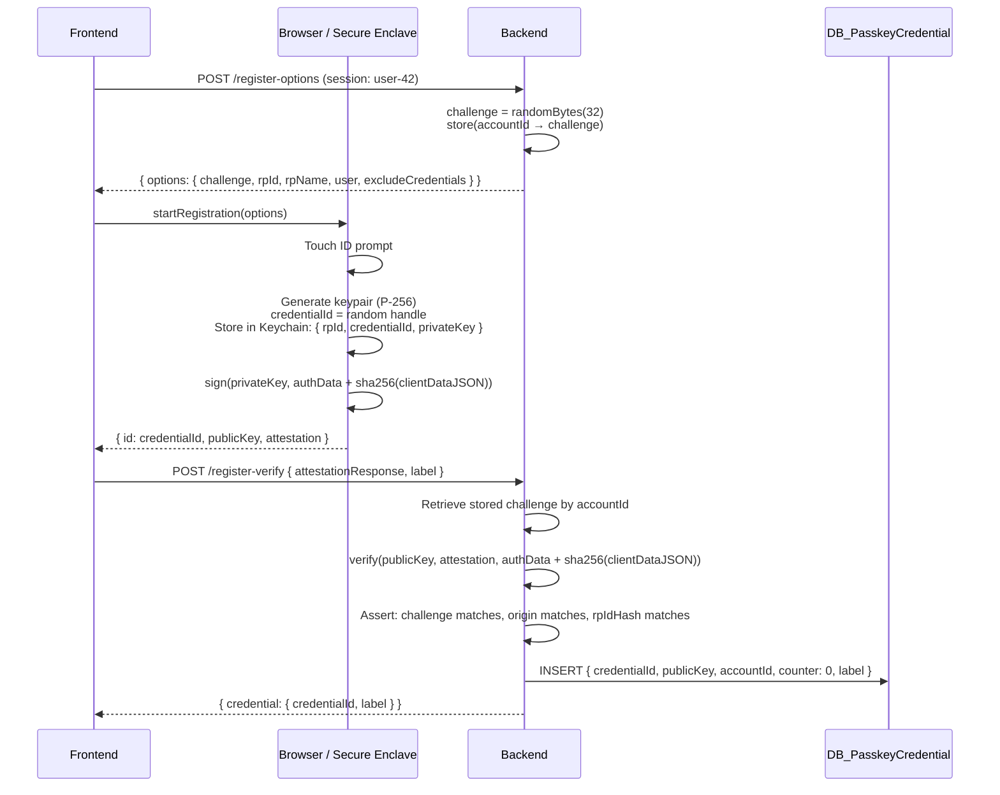

# Passkey Registration Flow

User must be authenticated (session exists). Binds a new credential to their account.

## What Gets Stored

| Location | Data | Purpose |
|----------|------|---------|
| Keychain (device) | privateKey + credentialId + rpId | Sign future login challenges |
| DB_PasskeyCredential (server) | publicKey + credentialId + accountId | Verify signatures, map credential → user |

## Key Facts

- `credentialId` is generated by the browser/OS — not the server
- `privateKey` never leaves the Secure Enclave
- `publicKey` is the only key that crosses the network (at registration time)
- The `credentialId` → `accountId` mapping in the DB is what closes the loop at login time
