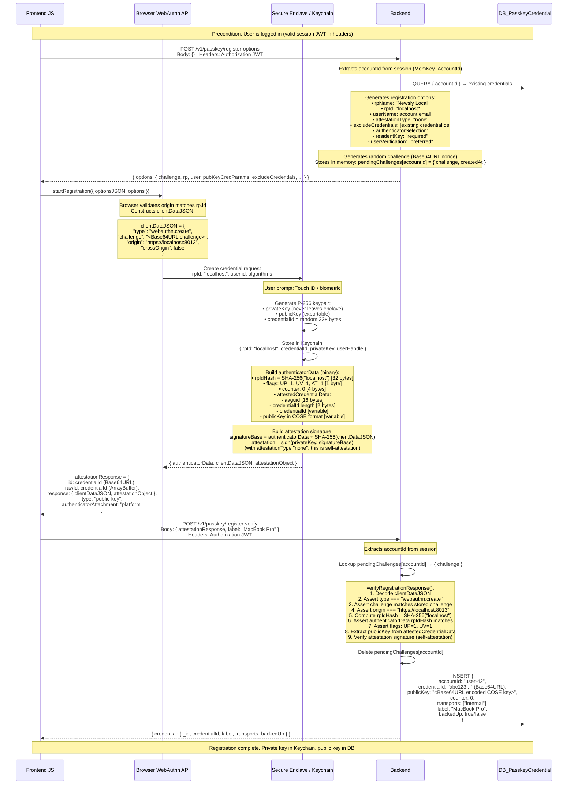

# Passkey Registration Flow

User must be authenticated (session exists). This flow binds a new credential to their account.

## Key Artifacts After Registration

| Location | What's stored | Purpose |
|----------|--------------|---------|
| Secure Enclave / Keychain | privateKey + credentialId + rpId + userHandle | Sign future challenges |
| DB_PasskeyCredential | publicKey + credentialId + accountId + counter | Verify signatures, map credential → user |
| Server memory | Nothing (challenge deleted) | — |

## Cryptographic Operations

| Step | Operation | Input | Output |
|------|-----------|-------|--------|
| Challenge generation | `crypto.randomBytes` | entropy | 32-byte Base64URL nonce |
| Key generation | P-256 ECDSA | Secure Enclave RNG | { privateKey, publicKey, credentialId } |
| rpIdHash | SHA-256 | `"localhost"` (UTF-8) | 32-byte hash |
| clientDataJSON hash | SHA-256 | JSON string | 32-byte hash |
| Attestation signature | ECDSA-P256-SHA256 | `authenticatorData \|\| SHA-256(clientDataJSON)` | DER-encoded signature |
