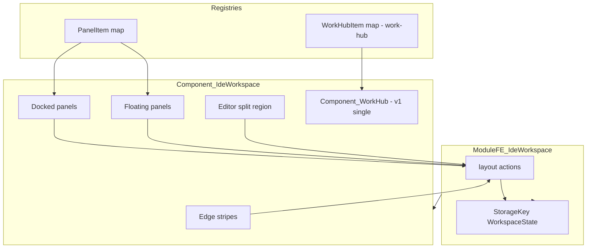

# IDE Workspace — human guide

**Audience:** Thunderstorm framework developers and consuming-app integrators.  
**Technical design:** this document (SSOT for v1).  
**Interactive reference:** [ide-workspace-sample.canvas.tsx](/Users/tacb0ss/.cursor/projects/Users-tacb0ss-dev-nu-art-beamz/canvases/ide-workspace-sample.canvas.tsx) — behavior prototype; not implementation source.  
**Package:** `_thunderstorm/ide-workspace/` (`@nu-art/ide-workspace-shared`, `@nu-art/ide-workspace-frontend`).

---

## Motivation

Product UIs that behave like IDEs need a **reusable shell**: dockable tool windows on the edges, a central editor area with splits, and content rendered **by registration key** so layout state stays serializable. Rebuilding this per app duplicates layout logic, persistence, and panel chrome.

`work-hub` already solves **document tabs** (open/close/select, groups, registry-by-key). It does **not** solve IDE chrome: edge panels, float/pin modes, split editor layout, or a workspace-level layout model.

---

## What it is

**IDE Workspace** is a Thunderstorm frontend capability library that composes:

1. A **workspace shell** — left / right / bottom dock edges, edge stripes, docked and floating tool panels.
2. An **editor region** — recursive split tree; each leaf hosts editor content.
3. A **panel registry** — `PanelItem` (mirrors `WorkHubItem`): apps register `{ key → renderer }`; persisted state stores only keys + args.

**Mental model:** IntelliJ tool windows around a center editor — except the center editor is powered by **work-hub** (v1: one shared instance).

---

## Vocabulary

| Term | Meaning |
|------|---------|
| **Workspace** | Full layout: tool panels + editor split tree. One persisted document. |
| **Tool panel** | Edge-hosted panel (Project, Inspector, Logs). Renders via `PanelItem` key. |
| **Edge stripe** | Collapsed edge UI — icon buttons that open/close panels on that edge. |
| **Panel mode** | `docked` (occupies layout), `floating` (overlay), or `closed` (stripe only). |
| **Editor pane** | Leaf in the split tree — tab strip + content area. |
| **Split tree** | Recursive `row` / `column` splits of editor panes. |
| **PanelItem** | Registered renderer for a tool panel key (like `WorkHubItem`). |
| **Context** | Anything work-hub can render — any registered `WorkHubItem` with its `renderArgs`. |

---

## Mental model

```
┌─────────────────────────────────────────────────────────────┐
│  title bar (optional — host-provided)                       │
├──┬──────────────────────────────────────────────────────┬──┤
│S │  ┌─ docked panel ─┐  ┌──── editor split tree ────────┐ │S │
│T │  │ PanelItem(key) │  │ leaf │ leaf │               │ │T │
│R │  └────────────────┘  │ tabs │ tabs │  (work-hub)   │ │R │
│I │                      └─────────────────────────────┘ │I │
│P │  ┌─ bottom docked panel(s) ─────────────────────────┐ │P │
│E │  │ PanelItem(key)                                   │ │E │
│  │  └──────────────────────────────────────────────────┘ │  │
├──┴──────────────────────────────────────────────────────┴──┤
│  bottom stripe                                            │
└─────────────────────────────────────────────────────────────┘
     + floating panels (absolute overlay, draggable)
```

---

## Shared data model (SSOT)

Types live in `@nu-art/ide-workspace-shared`. Layout state is **fully serializable** — no React nodes in storage.

### Dock edge & panel mode

```ts
type DockEdge = 'left' | 'right' | 'bottom';
type PanelMode = 'docked' | 'floating' | 'closed';
```

### Tool panel

```ts
type ToolPanel = {
  id: string;
  itemKey: string;       // PanelItem registry key
  title: string;         // stripe + chrome label
  edge: DockEdge;
  mode: PanelMode;
  float: { x: number; y: number; w: number; h: number };
};
```

### Editor split tree

```ts
type EditorTab = { id: string; itemKey: string; label: string; renderArgs?: unknown };

type PaneNode =
  | { type: 'leaf'; id: string; tabs: EditorTab[]; activeTabId?: string }
  | { type: 'split'; id: string; dir: 'row' | 'column'; children: PaneNode[] };
```

> **v1 note:** `EditorTab` mirrors work-hub tab shape for the split-tree scaffold. In v1 the **active editor region hosts a single `Component_WorkHub`** — the split tree models *where* work-hub lives and future multi-pane layout; tab CRUD in v1 goes through `ModuleFE_WorkHub` (see [Work-hub boundary](#work-hub-boundary-non-negotiable)).

### Workspace state

```ts
type WorkspaceState = {
  schemaVersion: 1;
  panels: ToolPanel[];
  editor: PaneNode;
};
```

Persisted via `StorageKey<WorkspaceState>` in `ModuleFE_IdeWorkspace`. On schema bump, migrate or reset with explicit version field.

---

## Registry contract — PanelItem

Mirrors [`WorkHubItem`](../../work-hub/frontend/src/main/_core/work-hub-item.ts):

| Capability | PanelItem | WorkHubItem (reference) |
|------------|-----------|-------------------------|
| Register by key | `ModuleFE_IdeWorkspace.panelItem.register` | `ModuleFE_WorkHub.workHubItem.register` |
| Renderer | `(panelItem, args?) => ReactNode` | `(workHubItem, tabId, args) => ReactNode` |
| Open / toggle | Shell opens panel by `itemKey` | `openTab(id, label, args)` |
| Fail-fast | `BadImplementationException` if key missing | Same |

Tool panels are typically **singletons per key** (one Project tree). Document tabs remain **work-hub** domain.

---

## Behavioral rules (v1)

Aligned with the [canvas sample](/Users/tacb0ss/.cursor/projects/Users-tacb0ss-dev-nu-art-beamz/canvases/ide-workspace-sample.canvas.tsx).

### Edge stripes

- Each edge shows one button per registered tool panel on that edge.
- Click toggles `closed` ↔ `docked` (first open → `docked`).
- Active panels use filled/highlighted stripe button.

### Docked panels

- Occupy layout space on their edge (left/right: fixed width column; bottom: fixed height row).
- Header: title, **float** (`⇱`), **close** (`×`).
- Close → `mode: 'closed'` (panel removed from layout, stripe remains).

### Floating panels

- `position: absolute` overlay inside workspace root.
- Draggable by header; `float.x` / `float.y` updated on drag end.
- **Pin** (`⇱` when floating) → `mode: 'docked'` on panel's `edge`.
- **Float** (`⇱` when docked) → `mode: 'floating'`; geometry from last `float` or defaults.

### Editor split tree

- **Split right** (`dir: 'row'`): target leaf becomes left child of new horizontal split; new empty leaf as sibling.
- **Split down** (`dir: 'column'`): target leaf becomes top child of new vertical split.
- **Prune:** closing/removing last tab in a leaf → remove leaf; if split has one child, collapse to child; if zero children, remove split.
- **No drag-and-drop** in v1 (no tab moves between panes, no panel edge moves).

### Work-hub boundary (non-negotiable)

- **`@nu-art/work-hub-*` packages are not modified** without explicit owner approval.
- v1 hosts **one** `Component_WorkHub` in the workspace center (single `ModuleFE_WorkHub` instance).
- Split-tree UI in v1 is **scaffold + layout persistence**; work-hub owns tab strip and tab content for the active editor region.
- **Multi-instance work-hub** (one per split leaf) is required future work — track with `@track(ide-workspace-multi-workhub)`.

---

## Operational flow

### App bootstrap

1. App registers `PanelItem` instances (project tree, inspector, logs, …).
2. App registers `WorkHubItem` instances (unchanged — work-hub).
3. App mounts `Component_IdeWorkspace` as root layout (or nested shell).
4. `ModuleFE_IdeWorkspace` restores `WorkspaceState` from `StorageKey` or applies defaults.

### Open a document

1. Feature calls `workHubItem.openTab(...)` — unchanged work-hub API.
2. Work-hub renders in the center editor region.
3. Optional: inspector `PanelItem` reads selection via dispatcher / module state.

### Toggle a tool panel

1. User clicks edge stripe **or** feature calls `ModuleFE_IdeWorkspace.panels.toggle(id)`.
2. Module updates `mode`, persists, dispatches `OnIdeWorkspaceLayoutUpdated`.

---

## Data flow



---

## Guarantees / invariants

- Layout state in storage contains **only serializable data** (keys, ids, geometry, enums).
- Missing `PanelItem` key at render time → `BadImplementationException` (fail-fast).
- UI components do not re-assert module invariants (see project mental model).
- Work-hub behavior and storage keys remain unchanged in v1.

---

## Scope

### Shipped (v1)

| Capability | Notes |
|------------|-------|
| Package scaffold | `shared` + `frontend` per package standard |
| `ModuleFE_IdeWorkspace` | Layout state, `PanelItem` registry, persistence, dispatchers |
| `Component_IdeWorkspace` | Shell layout |
| Docked panels + edge stripes | left / right / bottom |
| Floating panels | drag, pin/unpin, geometry memory |
| Editor split tree | split right/down, prune-on-empty; hosts single work-hub |
| Tests | Component/unit tests for tree helpers and module actions |

### Not shipped (v1)

| Capability | Notes |
|------------|-------|
| Multi-instance work-hub | One `ModuleFE_WorkHub` per split leaf — see `@track` |
| Drag-and-drop | Tab/panel repositioning |
| Top dock edge | Only left / right / bottom in v1 |
| Cross-window / multi-tab sync | Vision: [cross-window sharing](../../../beamz/_docs/vision/2026-07-13_00:58-ide-workspace-cross-window-sharing.md) |
| Resizable splitters | Fixed flex splits in v1; splitter handles later |

---

## What this is not

- Not a replacement for work-hub — it **wraps** work-hub in the center.
- Not a generic window manager — scoped to one workspace root per mount.
- Not the canvas file — canvas is interaction reference only.

---

## Related docs

- [work-hub README](../work-hub/frontend/README.md) (if present) / [`ModuleFE_WorkHub`](../work-hub/frontend/src/main/_module/ModuleFE_WorkHub/ModuleFE_WorkHub.ts)
- [Package standard](../../.rules/contributing/package-standard.mdc)
- Vision: [IDE workspace cross-window sharing](../../../beamz/_docs/vision/2026-07-13_00:58-ide-workspace-cross-window-sharing.md)
- Interactive reference: [ide-workspace-sample.canvas.tsx](/Users/tacb0ss/.cursor/projects/Users-tacb0ss-dev-nu-art-beamz/canvases/ide-workspace-sample.canvas.tsx)
