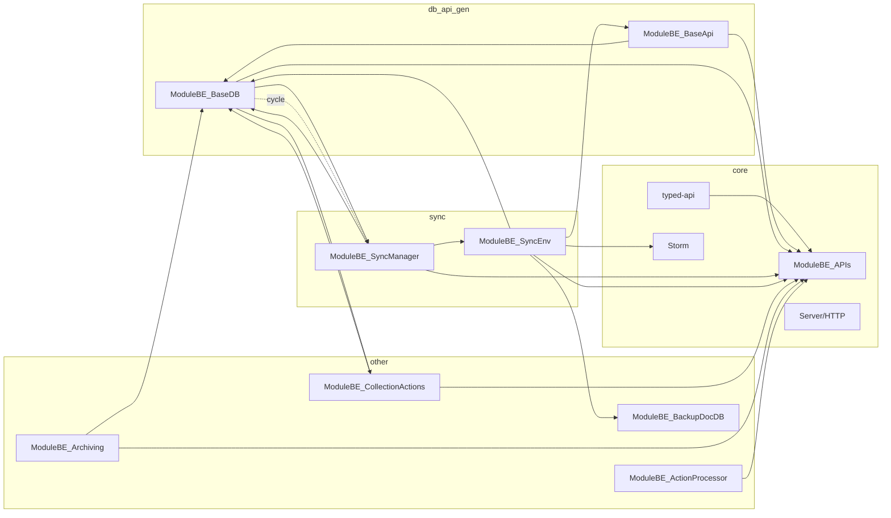

# Feature list, dependency graph, and cycle analysis

Companion to `todo.md`. Features inside the thunderstorm monolith, their dependency features, shared infra usage, category, then dependency graph and cycle untangling.

---

## 1. Feature list (nested: dependency features, shared infra, category)

### Core / platform (BE)

- **ModuleBE_APIs**
  - **Category:** BE
  - **Dependency features:** none (route registry only)
  - **Shared infra:** `@nu-art/ts-common` (Module)
  - **Notes:** Central route registry; other modules call `addRoutes()`.

- **typed-api** (createBodyServerApi, createQueryServerApi)
  - **Category:** BE (+ FE has own typed-api for client)
  - **Dependency features:** ModuleBE_APIs (addRoutes)
  - **Shared infra:** `@nu-art/ts-common`, `@nu-art/thunderstorm-shared` (ApiDef, BaseHttpRequest, BodyApi, QueryApi)

- **Server / HTTP** (HttpServer, server-api, route-resolvers, HeaderKey, consts)
  - **Category:** BE
  - **Dependency features:** ModuleBE_APIs (useRoutes), typed-api types
  - **Shared infra:** `@nu-art/ts-common`, `@nu-art/firebase-backend` (Firebase_ExpressFunction), `@nu-art/thunderstorm-shared` (ApiDef, QueryParams)

- **Storm / BaseStorm**
  - **Category:** BE
  - **Dependency features:** HttpServer, ModuleBE_Firebase, default-storm module pack
  - **Shared infra:** `@nu-art/ts-common`, `@nu-art/firebase-backend`

- **db-def** (DBApiBEConfig, getModuleBEConfig)
  - **Category:** BE (core config for db-api-gen)
  - **Dependency features:** none
  - **Shared infra:** `@nu-art/ts-common` (DBDef_V3, DBProto, etc.)

---

### db-api-gen (BE)

- **ModuleBE_BaseDB**
  - **Category:** BE
  - **Dependency features:** ModuleBE_SyncManager, collection-actions (dispatcher), db-def, ModuleBE_APIs (addRoutes), typed-api
  - **Shared infra:** `@nu-art/ts-common`, `@nu-art/firebase-shared` (FirestoreQuery), `@nu-art/firebase-backend` (ModuleBE_Firebase, FirestoreCollectionV3, DocWrapperV3, MemKey_DeletedDocs), `@nu-art/thunderstorm-shared` (Response_DBSync, sync-manager types)
  - **Notes:** **Cycle:** BaseDB → SyncManager; SyncManager → BaseDB.

- **ModuleBE_BaseApi**
  - **Category:** BE
  - **Dependency features:** ModuleBE_BaseDB, ModuleBE_APIs, typed-api
  - **Shared infra:** `@nu-art/ts-common`, `@nu-art/firebase-shared`, `@nu-art/thunderstorm-shared` (DBApiDefGeneratorIDBV3)

---

### Sync Manager (FE + BE + shared)

- **ModuleBE_SyncManager**
  - **Category:** BE
  - **Dependency features:** ModuleBE_BaseDB, sync-env (OnSyncEnvCompleted), _entity (OnModuleCleanupV2), ModuleBE_APIs, typed-api
  - **Shared infra:** `@nu-art/ts-common`, `@nu-art/firebase-shared`, `@nu-art/firebase-backend` (ModuleBE_Firebase, DatabaseWrapperBE, FirestoreCollectionV3), `@nu-art/thunderstorm-shared` (sync-manager types, apis, DBDef_DeletedDoc, DBProto_DeletedDoc)

- **ModuleFE_SyncManager**
  - **Category:** FE
  - **Dependency features:** none (calls BE API)
  - **Shared infra:** `@nu-art/ts-common`, `@nu-art/thunderstorm-shared` (sync-manager types, apis, BaseHttpRequest), `@nu-art/firebase-frontend` (ModuleFE_FirebaseListener)

- **sync-manager shared** (types, apis)
  - **Category:** shared
  - **Shared infra:** (types only; consumed by BE/FE)

---

### Sync Env (FE + BE + shared)

- **ModuleBE_SyncEnv**
  - **Category:** BE
  - **Dependency features:** ModuleBE_BaseApi_Class, ModuleBE_BaseDB, ModuleBE_BackupDocDB, Storm, AxiosHttpModule, ModuleBE_APIs, typed-api, server (MemKey_HttpRequest)
  - **Shared infra:** `@nu-art/ts-common`, `@nu-art/firebase-backend`, `@nu-art/thunderstorm-shared` (ApiDef_SyncEnv, request/response types)

- **ModuleFE_SyncEnvV2**
  - **Category:** FE
  - **Dependency features:** (API caller)
  - **Shared infra:** `@nu-art/thunderstorm-shared`

- **sync-env shared** (apis)
  - **Category:** shared

---

### Backup (BE only for now)

- **ModuleBE_BackupDocDB**
  - **Category:** BE
  - **Dependency features:** none (entity DB module)
  - **Shared infra:** `@nu-art/ts-common`, `@nu-art/firebase-backend`, `@nu-art/firebase-shared`, `@nu-art/thunderstorm-shared` (_entity/backup-doc api-def, db-def)

- **ModuleBE_BackupScheduler**
  - **Category:** BE
  - **Dependency features:** ModuleBE_BackupDocDB
  - **Shared infra:** `@nu-art/firebase-backend` (ModuleBE_FirebaseScheduler)

---

### Collection actions (FE + BE + shared)

- **ModuleBE_CollectionActions**
  - **Category:** BE
  - **Dependency features:** ModuleBE_BaseDB, dispatcher, ModuleBE_APIs, typed-api
  - **Shared infra:** `@nu-art/ts-common`, `@nu-art/thunderstorm-shared` (ApiDef_CollectionActions, CollectionActions_Upgrade/Check — via shared.ts)

- **dispatcher** (EntityDependencyCollection, dispatch_CollectEntityDependencies)
  - **Category:** BE (shared interface used by BaseDB and CollectionActions)
  - **Dependency features:** none
  - **Shared infra:** `@nu-art/ts-common` (Dispatcher), thunderstorm-shared (DBEntityDependencies via shared.ts)

- **ModuleFE_CollectionActions**
  - **Category:** FE
  - **Dependency features:** (API caller)
  - **Shared infra:** `@nu-art/thunderstorm-shared` (ApiDefCaller, ApiDef_CollectionActions, ApiStruct_CollectionActions)

- **collection-actions shared** (api-def, types — DBEntityDependencies, DBEntityDependencyError)
  - **Category:** shared

---

### Archiving (FE + BE + shared)

- **ModuleBE_Archiving**
  - **Category:** BE
  - **Dependency features:** ModuleBE_BaseDB, ModuleBE_APIs, typed-api
  - **Shared infra:** `@nu-art/ts-common`, `@nu-art/firebase-backend` (ModuleBE_FirestoreListener), `@nu-art/firebase-shared` (_EmptyQuery), `@nu-art/thunderstorm-shared` (ApiDef_Archiving, request types)

- **ModuleFE_Archiving**
  - **Category:** FE
  - **Shared infra:** `@nu-art/thunderstorm-shared` (ApiDef_Archiving, ApiDefCaller, ApiStruct_Archiving)

- **archiving shared** (apis)
  - **Category:** shared

---

### Action Processor (FE + BE + shared)

- **ModuleBE_ActionProcessor**
  - **Category:** BE
  - **Dependency features:** ModuleBE_APIs, typed-api
  - **Shared infra:** `@nu-art/ts-common`, `@nu-art/thunderstorm-shared` (action-processor: ApiDef_ActionProcessing, Request_ActionToProcess)

- **ModuleFE_ActionProcessor**
  - **Category:** FE
  - **Shared infra:** `@nu-art/thunderstorm-shared` (action-processor)

- **action-processor shared** (apis, index)
  - **Category:** shared

---

### App config (FE + BE + shared, entity)

- **ModuleBE_AppConfigDB / ModuleBE_AppConfigAPI**
  - **Category:** BE
  - **Dependency features:** ModuleBE_BaseDB / BaseApi (if used), ModuleBE_APIs, typed-api
  - **Shared infra:** `@nu-art/ts-common`, `@nu-art/thunderstorm-shared` (_entity/app-config)

- **ModuleFE_AppConfig**
  - **Category:** FE
  - **Shared infra:** `@nu-art/thunderstorm-shared` (AppConfig api-def, DB, DBProto)

- **app-config shared** (_entity/app-config api-def, db-def, types)
  - **Category:** shared

---

### Editable test (FE + BE + shared, entity)

- **ModuleBE_EditableTestDB**
  - **Category:** BE
  - **Dependency features:** ModuleBE_BaseDB (extends or uses), ModuleBE_APIs
  - **Shared infra:** `@nu-art/thunderstorm-shared` (_entity/editable-test types, db-def)

- **ModuleFE_EditableTest**
  - **Category:** FE
  - **Shared infra:** `@nu-art/thunderstorm-shared` (_entity/editable-test)

- **editable-test shared**
  - **Category:** shared

---

### Server info (FE + BE + shared)

- **ModuleBE_ServerInfo**
  - **Category:** BE
  - **Dependency features:** Storm, ModuleBE_APIs, typed-api
  - **Shared infra:** `@nu-art/ts-common`, `@nu-art/firebase-backend` (FirebaseRef, ModuleBE_Firebase), `@nu-art/thunderstorm-shared` (ApiDef_ServerInfo, Response_ServerInfo, etc.)

- **ModuleFE_ServerInfo**
  - **Category:** FE
  - **Shared infra:** `@nu-art/thunderstorm-shared`, `@nu-art/firebase-frontend` (ModuleFE_FirebaseListener)

- **server-info shared**
  - **Category:** shared

---

### Force upgrade (FE + BE + shared)

- **ModuleBE_ForceUpgrade**
  - **Category:** BE
  - **Dependency features:** ModuleBE_APIs, typed-api, server (HeaderKey)
  - **Shared infra:** `@nu-art/ts-common`, `@nu-art/thunderstorm-shared` (ApiDef_ForceUpgrade, Browser, HeaderKey_*, UpgradeRequired)

- **ModuleFE_ForceUpgrade**
  - **Category:** FE
  - **Shared infra:** `@nu-art/thunderstorm-shared`

---

### CleanupScheduler (BE)

- **CleanupScheduler**
  - **Category:** BE
  - **Dependency features:** (dispatchers / Firebase)
  - **Shared infra:** `@nu-art/ts-common`, `@nu-art/firebase-backend` (ModuleBE_Firebase, ModuleBE_FirebaseScheduler), `@nu-art/thunderstorm-shared` (ActDetailsDoc)

---

### HTTP client (BE)

- **AxiosHttpModule**
  - **Category:** BE
  - **Dependency features:** server (MemKey_HttpRequest)
  - **Shared infra:** `@nu-art/ts-common`, `@nu-art/thunderstorm-shared` (ApiDef, BaseHttpModule_Class, BaseHttpRequest, TypedApi)

---

### Routing (FE)

- **ModuleFE_Routing / ModuleFE_RoutingV2 / ModuleFE_BrowserHistory**
  - **Category:** FE
  - **Dependency features:** (internal routing state / history)
  - **Shared infra:** `@nu-art/thunderstorm-shared` (UrlQueryParams — in BrowserHistory)

---

### UI / misc FE

- **ModuleFE_BaseTheme, component-loader, ModuleFE_Utils, ModuleFE_Locale, ModuleFE_Print, etc.**
  - **Category:** FE
  - **Dependency features:** various (no BE coupling)
  - **Shared infra:** `@nu-art/ts-common`, `@nu-art/thunderstorm-shared` (consts e.g. Browser) where used

---

### _entity (aggregate)

- **OnModuleCleanupV2**
  - **Category:** BE (dispatcher contract)
  - **Dependency features:** exported from _entity (editable-test, app-config, backup-doc); SyncManager implements it
  - **Notes:** SyncManager → _entity; _entity modules may depend on BaseDB/BaseApi.

---

## 2. Shared infra summary (by category)

| Infra package | Used by (category) | Notes |
|---------------|--------------------|--------|
| `@nu-art/ts-common` | BE, FE, shared | Module, Dispatcher, types, utils — everywhere |
| `@nu-art/thunderstorm-shared` | BE, FE, shared | ApiDefs, types, entity defs — internal shared |
| `@nu-art/firebase-shared` | BE, shared | FirestoreQuery, _EmptyQuery, composeDbObjectUniqueId |
| `@nu-art/firebase-backend` | BE | ModuleBE_Firebase, FirestoreCollectionV3, ModuleBE_FirestoreListener, Firebase_ExpressFunction, etc. |
| `@nu-art/firebase-frontend` | FE | ModuleFE_FirebaseListener (SyncManager FE, ServerInfo FE) |
| (no `@nu-art/http-server` in thunderstorm) | — | Thunderstorm uses its own server/; db-api package uses @nu-art/http-server |
| (no `@nu-art/db-api` in thunderstorm) | — | Thunderstorm uses db-api-gen (in-repo); db-api is separate package |

---

## 3. Dependency graph (BE feature → feature)

Edges are “depends on” (module A imports or calls module B). Only significant runtime/import dependencies between features are shown; shared and ts-common are omitted for clarity.

```
                    ┌─────────────────┐
                    │  ModuleBE_APIs  │
                    └────────┬────────┘
                             │ addRoutes
         ┌──────────────────┼──────────────────┬────────────────────┬─────────────────────┬────────────────────┐
         ▼                   ▼                   ▼                    ▼                     ▼                   ▼
┌────────────────┐  ┌────────────────┐  ┌─────────────────┐  ┌─────────────────┐  ┌──────────────────┐  ┌─────────────────┐
│   typed-api    │  │  BaseApi       │  │ CollectionActions│  │   SyncEnv       │  │   SyncManager     │  │ Archiving       │
└───────┬────────┘  └───────┬────────┘  └────────┬────────┘  └────────┬────────┘  └────────┬─────────┘  └────────┬────────┘
        │                   │                     │                     │                     │                      │
        │                   │                     │                     │                     │                      │
        ▼                   ▼                     ▼                     ▼                     ▼                      ▼
┌─────────────────────────────────────────────────────────────────────────────────────────────────────────────────────────────┐
│                                              ModuleBE_BaseDB                                                                  │
│  (also uses: db-def, collection-actions/dispatcher, thunderstorm-shared sync-manager types)                                  │
└─────────────────────────────────────────────────────────────────────────────────────────────────────────────────────────────┘
        ▲                   │                     │                     │                     │
        │                   │                     │                     │                     │
        │                   └─────────────────────┴─────────────────────┴─────────────────────┘
        │                                         │
        │                                         │  ◄─── CYCLE: BaseDB imports SyncManager;
        │                                         │       SyncManager imports BaseDB.
        └────────────────────────────────────────┘
                             │
                    ┌────────┴────────┐
                    ▼                 ▼
            ┌──────────────┐  ┌─────────────────┐
            │ SyncEnv      │  │ OnSyncEnvCompleted (SyncManager implements)
            │ (Storm,      │  │ OnModuleCleanupV2 (_entity)
            │ BackupDocDB, │  └─────────────────┘
            │ BaseApi)     │
            └──────────────┘
```

**Simplified cycle:**

- **ModuleBE_BaseDB** → **ModuleBE_SyncManager** (queryDeleted, setLastUpdated, onItemsDeleted, setOldestDeleted)
- **ModuleBE_SyncManager** → **ModuleBE_BaseDB** (dbModules list, filterModules, per-module sync logic)

So: **db-api-gen (BaseDB) ↔ sync-manager** is the only direct feature–feature cycle identified.

Other notable edges (no cycle):

- SyncManager → sync-env (OnSyncEnvCompleted), _entity (OnModuleCleanupV2)
- SyncEnv → Storm, BaseApi, BaseDB, BackupDocDB, AxiosHttpModule
- CollectionActions → BaseDB, dispatcher
- Archiving → BaseDB
- BaseApi → BaseDB
- ServerInfo → Storm

---

## 4. Cyclic dependencies

| Cycle | Participants | Nature |
|-------|----------------|--------|
| **1** | **ModuleBE_BaseDB** ↔ **ModuleBE_SyncManager** | BaseDB calls SyncManager for deleted items and lastUpdated/oldestDeleted; SyncManager discovers and uses all BaseDB modules for smart sync. |

No other feature–feature cycles were found; remaining deps form a DAG into BaseDB and SyncManager.

---

## 5. How to untangle the cycle (BaseDB ↔ SyncManager)

**Option A: SyncManager as the only “knower” of BaseDB (invert dependency)**  
- BaseDB must not import SyncManager.  
- Introduce an abstraction used by BaseDB for “sync side-effects” (e.g. `SyncNotifier` or `DeletedItemsTracker`): notify on write/delete and query deleted IDs.  
- SyncManager implements that abstraction and registers with the Storm; BaseDB receives it via constructor or a resolver (e.g. `ResolvableContent<SyncNotifier>`).  
- BaseDB depends on the interface only; SyncManager depends on BaseDB (runtime list of modules).  
- **Result:** BaseDB → interface; SyncManager → interface + BaseDB. Cycle broken.

**Option B: Extract sync contract to shared, both depend on it**  
- New shared types: e.g. `SyncNotifier` (BE-facing interface), request/response types for “query deleted” / “set last updated” / “on items deleted”.  
- BaseDB calls the interface (implementation provided at app wiring).  
- SyncManager implements the interface and discovers BaseDB modules via RuntimeModules (unchanged).  
- **Result:** BaseDB → shared contract; SyncManager → shared contract + BaseDB. Cycle broken; shared stays FE+BE-agnostic if the contract is BE-only and lives in a BE shared layer or in thunderstorm-shared as “sync contract”.

**Option C: Move sync logic out of BaseDB into a separate layer**  
- BaseDB does not perform sync updates; a “post-write” layer (e.g. FirestoreCollectionV3 callback or a dedicated module) listens to write/delete events and calls SyncManager.  
- BaseDB’s `querySync` and “deleted items” could be moved to a SyncManager-owned helper that takes a collection name and query and uses Firestore (or a thin BaseDB-agnostic API).  
- **Result:** BaseDB no longer calls SyncManager; SyncManager still depends on BaseDB (module list). Cycle broken; more refactor.

**Recommendation:** Option A or B. Option A keeps the contract in BE and avoids new shared surface if you want “sync” to remain a BE concern until a dedicated sync package exists. Option B prepares for a future shared “sync contract” package (e.g. when extracting Sync Manager).

**After untangling:**  
- BaseDB (and eventually `@nu-art/db-api` backend) will depend only on the sync interface, not on SyncManager.  
- SyncManager can stay in thunderstorm or move to a separate package that depends on the interface and on “something that provides a list of DB modules” (Storm / RuntimeModules or a future db-api registry).

---

## 6. Mermaid dependency graph (BE features only, simplified)



---

## 7. Next steps

1. **Decide untangle strategy:** Choose Option A, B, or C (or a variant) for BaseDB ↔ SyncManager.  
2. **Introduce SyncNotifier (or equivalent):** Define interface in BE or thunderstorm-shared; BaseDB uses it; SyncManager implements it.  
3. **Remove `ModuleBE_SyncManager` import from `ModuleBE_BaseDB.ts`:** Replace direct calls with interface calls.  
4. **Re-run dependency scan** after extraction (e.g. when db-api is fully adopted and thunderstorm BE uses it) to confirm no new cycles.  
5. **When extracting Sync Manager / Sync Env:** Use the same contract so the new package depends on “sync contract” + “list of DB modules”, not on thunderstorm.
